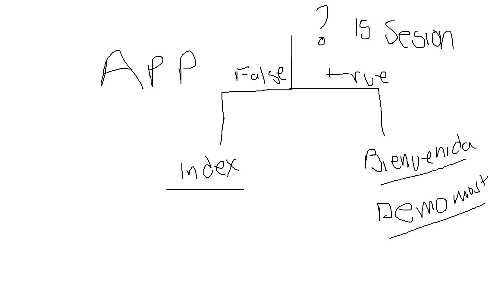

# Semana 5 Trabajando con Sesiones
## Código de sesion
En esta clase aprendimos a usar los inicios de sesion para restringir y controlar las paginas o modulos de nuestra aplicación en el archivo index tenemos este codigo sobre inicio de sesion.

    session_start();

    // comprobar si el usuario ha iniciado sesión
    // Este código validad si la sesion esta iniciada, si es asi, redirige a la pagina de bienvenida
    if (isset($_SESSION['username'])) {
        header('Location: bienvenida.php');
        exit;
    }

En los demas modulos usamos el archivo validate.php que pregunta sobre sesiones activas y controla el despliege

## Ejemplo de el uso de sesiones en app web

## validate.php

    <?php

        // validate.php: este archivo se incluirá en todas las páginas que requieran autenticación
        // Verificar si el usuario ha iniciado sesión, de lo contrario redirigir al login

        session_start();

        // comprobar si el usuario ha iniciado sesión
        if (!isset($_SESSION['username'])) {
            // no hay sesión activa, redirigir al inicio de sesión
            header('Location: index.php');
            exit;
        }
    ?>

## uso del Archivo validate
Integrando a todos los archivos que requieran inicio de sesion ejemplo bienvenida.php

    <?php
    include 'validate.php';
    ?>

    <!DOCTYPE html>
    <html lang="en">
    <head>
        <meta charset="UTF-8">
        <meta name="viewport" content="width=device-width, initial-scale=1.0">
        <title>Document</title>
    </head>
    <body>
        <h1>Bienvenido</h1>
        
Hola <?php echo htmlspecialchars($_SESSION['username']); ?>, bienvenido a la página de bienvenida.

        <!-- botón de cierre de sesión -->
        <form action="logout.php" method="post" style="display:inline;">
            <button type="submit">Cerrar sesión</button>
        </form>

    </body>
    </html>